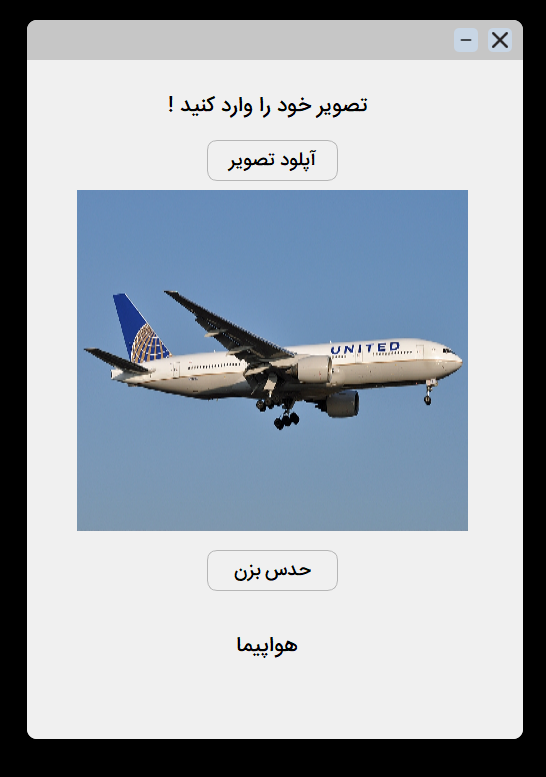

# Object Classification with YOLO CIFAR-10 model and PyQt5

This project provides a graphical user interface (GUI) for object classification using a YOLOv5 model. The GUI allows users to upload an image, perform predictions using a pre-trained model.

## Features

- **User-friendly GUI**: Designed using PyQt5 with a frameless, transparent window.
- **Image Upload**: Supports PNG and JPG formats.
- **YOLO Integration**: Utilizes a pre-trained YOLOv5 model for image classification.
- **Drag and Move Window**: Click and drag anywhere in the window to reposition it.

## How It Works

1. **Image Upload**:
   - Click the **Upload** (آپلود) button to select an image file.
   - The image will be displayed within the GUI.

2. **Prediction**:
   - Click the **Predict** (حدس بزن) button to classify the uploaded image.
   - The classification result will be displayed in Persian (Farsi).

3. **Multi-language Results**:
   - The model outputs a prediction in English, which is then translated into Persian for the GUI display.

## Requirements

- Python 3.8+
- PyQt5
- YOLO (via Ultralytics)

Install the required Python packages:
```bash
pip install -r requirements.txt
```
## Running the Application
1. Clone this repository:
   ```bash
   git clone https://github.com/AmirRghp/CIFAR-10-Prediction.git
   cd CIFAR-10-Prediction
   ```
2. Ensure your pre-trained YOLOv5 model is available at the specified path `(./runs/classify/train2/weights/best.pt).`
3. Run the application:
   ```bash
   python main.py
   ```
## Project Structure
   - `main.py`: Main script containing the application logic and GUI.
   - `predictUI.ui`: User interface layout designed with Qt Designer.
   - `runs/classify/train2/weights/best.pt`: Pre-trained YOLOv5 model weights.

## Example Results
   - English Predictions:
     - airplane → هواپیما
     - automobile → ماشین
     - cat → گربه
     - dog → سگ
     - deer → گوزن
     - bird → پرنده
     - frog → غورباقه
     - horse → اسب
     - ship → کشتی
     - truck → تراکتور

## screenshot



## Notes
   - Make sure the pre-trained YOLOv5 model file (best.pt) exists at the path `./runs/classify/train2/weights/best.pt`.
   - The GUI currently supports Persian translations for the predefined classes.

## Contributing
Contributions are welcome! Feel free to fork this repository and submit pull requests.